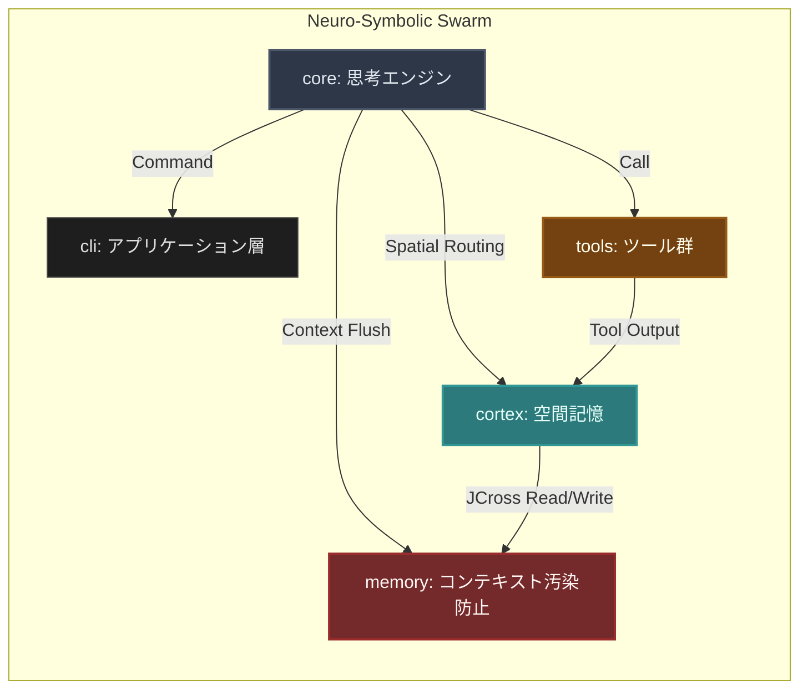

# Verantyx 🧠

**一晩でタスクを完遂する、ローカルMac専用の自己進化型 Neuro-Symbolic Swarm Agent**

Verantyxは、単なるAIアシスタントではありません。あなたのMacのローカルリソース（M1/M2/M3/M4 Max）を極限まで使い切り、一晩で数週間分のエンジニアリングタスクを自律完遂する**自己進化型の群知能（Swarm）エージェント**です。

## 🎯 Concept

現代のAIコーディングは、コンテキスト制限とハルシネーション（幻覚）に悩まされています。
Verantyxはこれを解決するため、生物の脳の構造を模倣した **Neuro-Symbolic Architecture** を採用しました。

- **Neuro（直感）:** 軽量かつ高速なローカルLLM（Gemma / BitNet等）による超並列ルーティングと瞬時の意思決定。
- **Symbolic（論理）:** `JCross` 空間記憶と L1〜L3 キャッシュ層を用いた、決定論的かつ汚染ゼロのコンテキスト管理。

この2つを融合させることで、数万ターンに及ぶ自律ループでもコンテキストを崩壊させず、確実にプロジェクトを完遂へと導きます。

## 📂 Architecture

今回、点在していた各神経モジュールを単一の「Verantyx モノレポ」として完全に統合しました。これらは互いに独立しつつも、MCP（Model Context Protocol）を通じて有機的に結合し、1つの巨大な Swarm を形成します。



### 1. `core/` (思考エンジン)
Swarm全体の「大脳皮質」。Gemma 4 26B などのローカルモデルを高速な `mlx-swift` や BitNetデーモンで駆動させます。
Zero-Prefillによる超高速推論で、複数のワーカーエージェントを束ねて超並列でタスクを実行します。

### 2. `cortex/` & `cortex-ios/` (空間記憶)
タスクの全体像やディレクトリ構造を `JCross` フォーマットの空間構造として保持します。
フラットなテキストではなく、ディレクトリやファイルの「意味的な距離」をL1.5インデックスとしてグラフ化し、ワーカーが必要な記憶だけをミリ秒単位で引き出せるようにします。

### 3. `memory/` (コンテキスト汚染防止)
かつての `pure-through` プロジェクトを統合した、忘却と長期記憶の管理モジュール。
無限ループ実行時にVRAM限界（OOM）を防ぐため、重要度（Zone）に応じて記憶を動的に L1（高速メモリ）から L3（ストレージ）へ退避・スワップします。

### 4. `tools/` (ツール群)
エージェントが下界と接触するための「手足」。
`tool-search-oss` をベースとし、MCPサーバー群（ファイル操作、ウェブ検索、ターミナル実行など）をダイナミックに検索・ロードしてタスクを実行します。

### 5. `cli/` (CLI & IDE)
旧バージョンの Verantyx-CLI や IDE 機能が集約されたエントリーポイント。
Swarm の自律駆動（AgentLoop）をホストし、人間が介入できるGUI/CUIインターフェースを提供します。

## 🚀 Get Started

Verantyx Swarm を起動して、圧倒的なパフォーマンスを体験してください：

```bash
# SwarmエージェントのBootと再コンテキスト化
cd cli
npm install
npm run dev
```

*あなたのMacが、眠らない最強のエンジニアリング・チームに進化します。*
