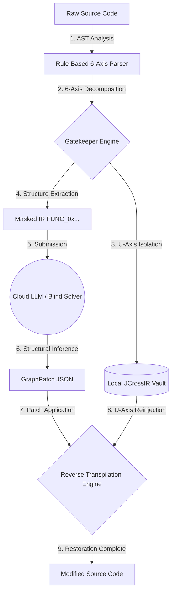

<div align="center">
  <h1>🛡️ Verantyx IDE & Cortex Engine</h1>
  <p><b>The Zero-Leakage, Neuro-Symbolic AI Coding Gateway & Native macOS IDE</b></p>
  <p><i>Trading token efficiency for mathematically guaranteed security, deterministic patching, and autonomous skill generation.</i></p>

  <p>
    <a href="https://github.com/verantyx/verantyx/releases/latest"></a>
    
    
    
  </p>

  <p>
    <a href="#-the-hacker-news-pitch-why-verantyx">Why Verantyx?</a> •
    <a href="#-the-heart-of-gatekeeper-6-axis-jcross-ir">Gatekeeper 6-Axis IR</a> •
    <a href="#-technical-capabilities">Capabilities</a> •
    <a href="#-whats-new-in-v140">What's New</a> •
    <a href="#-contribute">Contribute</a>
  </p>
</div>

---

## 📦 Download

**[→ Download Latest Release (v1.4.0)](https://github.com/verantyx/verantyx/releases/latest)**

1. Download **`VerantyxIDE-1.4.0.pkg`**
2. Double-click the installer to automatically overwrite any old versions.

---

## 🌌 The Hacker News Pitch: Why Verantyx?

The current AI coding revolution is fundamentally broken for the enterprise and security-conscious developers. Uploading proprietary codebase context to external APIs (OpenAI, Anthropic) results in **Semantic Leakage**. Conversely, relying purely on local edge models often results in context-window exhaustion and poor complex refactoring logic.

Verantyx was built to resolve this paradox through a **Neuro-Symbolic architecture** that protects your IP via mathematical abstraction, grounds local AI against hallucinations via Visual Anchors, and achieves infinite context resolution through spatial memory. 

---

## 🔐 The Heart of Gatekeeper: 6-Axis JCross IR

Gatekeeper Mode is the "absolute firewall" standing between your local machine and the external cloud LLM. Its core technology is the **JCross IR (Intermediate Representation)** metamodel, which reinterprets source code not merely as "text," but as a spatial structure.

JCross IR decomposes source code into the following six dimensions (axes):

| Axis | Name | Role / Content |
| :--- | :--- | :--- |
| **X-axis** | *Control Flow* | Axis of time and sequence. `if` branches, loops, exceptions. |
| **Y-axis** | *Data Flow* | Axis of dependency. Variable assignment, argument passing. |
| **Z-axis** | *Type Constraints* | Boundary axis. Classes, type definitions, generics. |
| **W-axis** | *Memory Lifecycle* | Lifespan axis. Scope lifespan, memory allocation/deallocation. |
| **V-axis** | *Scope Hierarchy* | Inclusion axis. Modules, class nesting. |
| **U-axis** | **Semantics & Meaning** | **Intent axis. Variable names, function names, strings, raw values.** |

### Absolute Security via "U-Axis" Extraction
Simply replacing variables with random hashes prevents an LLM from understanding logical structure (like loop bounds or scope). Instead, Gatekeeper uses a rule-based parser to analyze the AST, **physically extracts ONLY the U-axis (semantics)**, and isolates it in a local `JCrossIRVault`. 

Only the pure logic and structural framework (X, Y, Z, W, V axes) are sent to the external Cloud LLM.

### Before & After Example

**[Before] Raw Source Code (Local Environment)**
```swift
func calculateTax(price: Double) -> Double {
    let taxRate = 1.21
    return round(price * taxRate, 2)
}
```

**[After] Masked JCross IR (Sent to Cloud LLM)**
Business logic and sensitive data are removed, but the topology ("function arguments are multiplied and returned") remains perfectly intact.
```swift
func FUNC_0xA1B2(VAR_0x3C4: TYPE_DOUBLE) -> TYPE_DOUBLE {
    let VAR_0x9D5 = CONST_0xF1
    return CALL_0xE5A(VAR_0x3C4 * VAR_0x9D5, CONST_0x02)
}
```

### The Reverse-Transpilation Pipeline
The LLM solves this structural puzzle and returns a JSON patch. The local Vault then deterministically reinjects the U-axis to generate the final code. 



---

## 🚀 Technical Capabilities

### 1. 5-Type Cognitive Memory (L1 to L3)
Standard text-based RAG causes context-window amnesia. Verantyx uses a 5-tier spatial memory system (ranging from L1 Kanji Semantic Vectors to L3 Raw Facts). Because of this deep structural memory, the Commander model can accurately resolve highly ambiguous pronouns (e.g., *"change this logic to match what we did earlier for that other module"*) long after the context window would normally be exceeded.

### 2. Cross-Client Context Sync (Verantyx Cortex MCP)
Your coding session doesn't live in a silo. By leveraging the **Verantyx-Cortex MCP Tool**, conversations and memory states created in Claude Desktop or Antigravity agents are seamlessly shared with the Verantyx IDE via JCross spatial memory. All your AI clients share the exact same persistent brain.

### 3. Verantyx Swarm: Asymmetric Multi-Agent System 🐝
Running a true multi-agent swarm locally has historically been impossible due to VRAM constraints. Verantyx solves this by implementing an **Asymmetric Multi-Agent Topology (Time-Sharing KV Cache)**:
*   **The Router (Gemma 4 26B)**: A single high-intelligence model acts as the Project Manager. It translates ambiguous user intents into strict, low-entropy structural patches.
*   **The Swarm (50x BitNet 1.58b)**: Leveraging 1-bit quantization, Verantyx loads up to 50 micro-agents (30 Coders, 20 Checkers) simultaneously in unified memory. 
*   **JCross Blackboard**: To prevent cascading failures and communication chaos, agents do NOT message each other directly. Instead, they submit AST-validated patches (Pull Requests) directly to the central JCross Spatial Topology. The Gemma Router maintains oversight over the entire graph without suffering from context exhaustion.

### 4. Visual Anchors & Anti-Hallucination ⚓️
Local LLMs often suffer from "sycophancy" (answering confidently even when hallucinating facts). 
When Verantyx detects potential hallucinations, it injects **Visual Anchors** (rendering strict text directives as Base64 images). By feeding these images into a Multi-Modal LLM, it targets the visual cortex of the model to bypass text-attention degradation. 

**Real-world flow:** When asked about non-existent libraries (e.g., *"Use pandas.quantum_compress()"*), the IDE injects a Visual Anchor to force fact-checking, triggers a background Stealth Web Search, retrieves the top 3 results, realizes the function is a hallucination, and correctly explains how to use `pd.to_numeric(downcast=...)` instead.

### 5. Autonomous Skill Generation (Zero-Shot Tools)
Verantyx is deeply autonomous. If a user requests a task (e.g., *"Record the screen based on the system definition"*) but the required OS-level screen recording API is unavailable, the agent **does not say "I can't do it."** 
Instead, it recognizes that DOM-based capturing is a viable alternative, autonomously writes the required tool logic in real-time, registers it as a new persistent "Skill", and executes the user's request. 

**Demo: The Agent Writes Its Own Tool on the Fly**
The video below demonstrates the agent receiving a request it lacks a built-in tool for, writing the required DOM-based tool logic, and executing it seamlessly.
<video src="https://github.com/verantyx/verantyx/releases/download/v1.2.5/demo_skill_generation.mov" controls="controls" muted="muted" style="max-width: 100%; border-radius: 8px;"></video>

### 6. Biometric Stealth Browser 🕵️‍♂️
Agents must interact with the live web to read documentation, but BotGuard and Cloudflare block headless browsers.
Verantyx captures your physical keyboard cadence (typing entropy) and mouse trajectory (mouse entropy) locally. When the agent browses the web, it replays your exact human biometric entropy using macOS `CGEvent` simulation to completely bypass bot detection—all while running completely in the background without stealing your OS window focus.

---

## ✨ What's New in v1.4.0

- **Verantyx Swarm Architecture**: Introduced an asymmetric multi-agent infrastructure routing tasks from Gemma 4 26B to 50 concurrent BitNet workers via JCross Blackboard state management.
- **Swarm Monitor UI**: Added a dedicated responsive 50-agent monitor layout to visualize active Coders and AST Gatekeeper Checkers.
- **Unified Visual Anchor Support**: Extended Visual Anchor injection compatibility to MLX-based models.
- **macOS Native Fullscreen & Biometric Prompts**: Enhanced native UX by leveraging `AXFullScreen` AppleScript overrides and Dock icon bounce events (`NSApp.requestUserAttention`) for biometric puzzle requests.

---

## 🛠 Features Summary

| Feature | Status |
|---|---|
| 🤖 Local Inference (Ollama, MLX Apple Silicon) | ✅ v1.0 |
| 🛡️ Gatekeeper Mode (Zero-Leakage 6-Axis IR) | ✅ v1.0 |
| 🧠 Tri-Layer JCross Memory (Cortex) | ✅ v1.0 |
| 🧩 Verantyx Cortex MCP (Cross-Client Sync) | ✅ v1.1 |
| ⚡ BitNet 1.58b 1-bit LLM support | ✅ v1.1 |
| 👁️ Visual Anchor Prompt Injection | ✅ v1.2 |
| 🕵️‍♂️ Biometric Stealth Browser (Bot Evasion) | ✅ v1.2 |
| 🧬 Autonomous Skill/Tool Generation | ✅ v1.2 |
| 🐝 Asymmetric Swarm Architecture | ✅ v1.4 |

---

## 🤝 Contribute

We are building the future of secure AI development. Building AST extractors and neuro-symbolic memory bridges is a complex systems engineering challenge. 

**We have built the Core Engine. We need the community to build the Periphery.**
If you want to contribute to a serious systems programming project, look for these issues in the repo:
- 🏷️ `help wanted`: **Go AST Parser** (Mapping Go `struct` to JCross IR)
- 🏷️ `help wanted`: **Rust AST Parser** (Mapping lifetimes to JCross edges)
- 🏷️ `good first issue`: UI/UX enhancements in the native SwiftUI client.

---

## 💻 Building from Source (macOS Only)

**Prerequisites:**
- macOS 14.0+ (Apple Silicon highly recommended)
- Xcode 15.0+

```bash
git clone https://github.com/verantyx/verantyx.git
cd verantyx/VerantyxIDE
open Verantyx.xcodeproj
# Select the Verantyx scheme and hit Cmd+R
```

*Note: A Windows/Linux port (Rust core + llama.cpp) is on our long-term roadmap, but we are laser-focused on perfecting the native macOS/MLX architecture first.*
