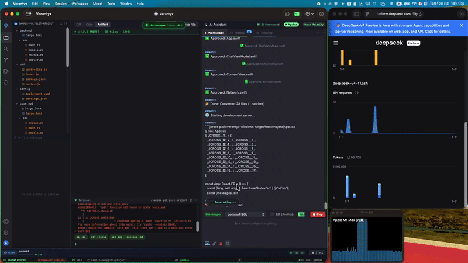

# ⚡ Verantyx

> **Apple Silicon ネイティブ AI コードアシスタント。完全オフライン。APIコストゼロ。**

<!-- TODO: Add 30-second demo GIF here -->
<!--  -->

Verantyx は macOS 専用の AI コードエディタです。  
HuggingFace の MLX モデルまたは Ollama を使い、ローカルで推論を実行。  
ファイルを選んで自然言語で指示するだけで、コード差分を提案・適用します。

## ✨ Features

| Feature | Status |
|---|---|
| 🤖 Ollama 統合（gemma4:26b 等） | ✅ v0.1 |
| 💬 ファイルを選択してAIへ指示 | ✅ v0.1 |
| 🔍 変更箇所を Diff で確認 → ワンクリック適用 | ✅ v0.1 |
| 📂 任意フォルダをワークスペースとして開く | ✅ v0.1 |
| 🔒 完全オフライン（Wi-Fi 不要） | ✅ v0.1 |
| ⚡ Apple Silicon GPU フル活用 | ✅ v0.1 |
| ⬇️ HuggingFace MLX モデル自動ダウンロード | 🔜 v0.2 |
| 🧠 JCross プロジェクト記憶 | 🔜 v0.2 |

## 📦 Download

**[→ Releases](https://github.com/Ag3497120/verantyx/releases/latest)** から `.app.zip` をダウンロード。

初回起動時は Gatekeeper をバイパスする必要があります：

```bash
xattr -cr /Applications/Verantyx.app
```

## 🚀 Requirements

- macOS 13.0+
- Apple Silicon (M1/M2/M3/M4)
- [Ollama](https://ollama.com) （推奨: `ollama pull gemma4:26b`）

## 🛠 Build from Source

```bash
git clone https://github.com/Ag3497120/verantyx.git
cd verantyx
brew install xcodegen
xcodegen generate
open Verantyx.xcodeproj
```

Xcode でビルド（⌘B）後、実行（⌘R）。

## 🔧 Usage

1. **Ollama を起動**: `ollama serve`
2. **Verantyx を起動**
3. ツールバーの●ボタンで「Connect Ollama」
4. 「Open Workspace」でプロジェクトフォルダを選択
5. ファイルツリーから編集したいファイルをクリック
6. チャットに指示を入力して送信
7. Diff が右パネルに表示 → **Apply** で適用

## 📐 Architecture

```
Verantyx/
├── Engine/
│   ├── AgentEngine.swift      # 指示 → 推論 → Diff抽出
│   ├── DiffEngine.swift       # Pure Swift LCS diff
│   ├── OllamaClient.swift     # Ollama /api/chat
│   └── WorkspaceManager.swift # ファイルI/O
└── Views/
    ├── MainSplitView.swift    # 3ペインレイアウト
    ├── FileTreeView.swift     # ファイルツリー
    ├── ChatPanelView.swift    # チャットUI
    ├── DiffPanelView.swift    # Diff表示 + Apply
    └── ModelPickerView.swift  # モデル選択
```

## 📄 License

MIT License — fork & hack freely.
