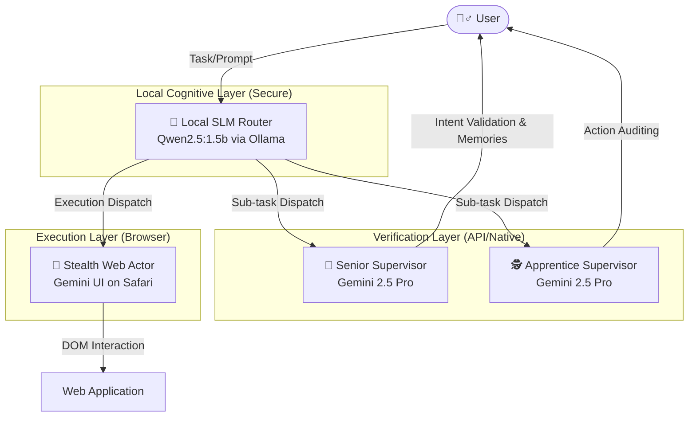

<div align="center">
  <h1>Verantyx: 4-Node Agentic Hierarchy & Carbon Paper UI</h1>
  <p><b>A highly resilient, Human-in-The-Loop Autonomous Agent System built on top of OpenClaw infrastructure.</b></p>
</div>

## 🌐 Overview

The **Verantyx Browser** subsystem introduces a revolutionary 4-node agentic architecture designed to bypass modern BotGuard and CAPTCHA mechanisms (like those aggressively employed by platforms such as Google Gemini & Claude) while maintaining robust, long-term memory and autonomous task execution capabilities. 

By combining local Small Language Models (SLMs) with a robust "Supervisor/Worker" hierarchy, Verantyx acts as a sentient spatial router. Crucially, we enforce a **Carbon Paper UI (Human-in-The-Loop)** mechanism to manually mediate clipboard interactions, definitively solving the bot-detection crisis.

## ✨ Epic New Features (Vera Lab & Spatial Synthesis)

Verantyx has evolved beyond a simple CLI into a full 3D cybernetic workstation.

*   🌌 **Vera Memory (3D Cyber Space)**: Type `vera` to launch a stunning D3/Three.js integrated 3D neural map of your codebase's spatial index.
*   🔮 **Multi-Node Crucible Synthesis**: Drag and drop up to **10 distinct architecture nodes** into the Crucible Reaction Zone. Click the glowing `[SYNTHESIZE]` button to physically fuse their JCross logic into brand new architectural intermediate representations (IR).
*   👁️ **Cyberpunk Finder Mode**: Click any node in the 3D map to slide out the sleek Finder Panel. Instantly read the raw source code and JCross semantic tags cleanly inside the browser via our new `/cat` local bridge API.
*   🎯 **Zero-DOM Safari Injection Tracking**: The system autonomously tracks your active Safari windows, dynamically locating the `gemini.google.com` tab via raw AppleScript geometry matching. It guarantees prompts are securely injected without relying on immediately-flagged Headless DOM automation.
*   🦉 **Nightwatch Observer**: A local daemon that silently monitors and losslessly compresses your code repository into spatial `JCross` memory structures overnight.

---

## 🏗️ The 4-Node Hierarchical Architecture

The system is split into four distinct cognitive nodes, completely isolating planning logic from raw web execution.



### 1. The Local Planner (SLM: Qwen2.5)
The brain of the operation runs on local hardware using `Ollama`. It maintains long-term memory, parses user intent, avoids context dilution, and breaks down complex prompts into specific sub-tasks to be dispatched to the remote models. It serves as an impermeable wall protecting the core agent logic from the massive context window destruction prevalent in long-running cloud instances.

### 2. Senior Supervisor (Gemini via API)
The Senior Supervisor receives payloads from the SLM, analyzing them to ensure the output aligns exactly with what the User intended. It injects additional memory and refines prompts without actually executing them on the target machine.

### 3. Apprentice Supervisor (Gemini via API)
The Apprentice operates on a 5-turn promotion cycle, shadowing the Senior and ensuring spatial state is synced accurately within the `.ronin/experience.jcross` database.

### 4. Stealth Worker (Gemini UI on Safari)
The "Hands and Feet". This node controls the actual Web UI. Because BotGuard instantly detects headless Chrome automation, puppeteer, or injected JavaScript events, the Worker operates **entirely via human-mediated native OS actions**.

---

## 🛡️ Carbon Paper UI (BotGuard Evasion & HITL)

To defeat advanced anti-bot systems, we implemented the **Carbon Paper UI**—a secure "Human-in-The-Loop" (HITL) manual handoff protocol.

Instead of writing scripts to click buttons (which are instantly blocked), the system automatically formats the perfectly optimized prompt and securely injects it into the macOS Clipboard. It then prompts the user via a terminal Dialoguer.

### Operational Flow

1. **Prompt Generation:** SLM + Supervisors construct the optimal prompt.
2. **Clipboard Hydration:** The OS Clipboard is silently loaded via `arboard`.
3. **Target Acquisition:** The user is prompted in the CLI. The system programmatically brings `Safari` to the foreground via macOS Native APIs, specifically hunting for the Gemini tab.
4. **Human Actuation / Auto-Stealth:** Depending on your mode, the system either gracefully pastes the content or prompts you to hit `Cmd+V + Enter`. This completely circumvents BotGuard.
5. **Tamper Verification:** The agent polls the clipboard post-submission using geometric extraction to ensure flawless extraction.

---

## 🚀 Getting Started & CLI Commands

Ensure you have your environment set up and `Ollama` running with your desired parameter models.

### 🖥️ Launch the Core Engine
Start the primary Verantyx interactive chat repl.
```bash
cd verantyx-cli/verantyx-browser
cargo run -p ronin-hive --example interactive_chat
```

### 🧠 REPL Commands
Once inside the REPL, you can utilize the following spatial intelligence commands:

*   **`vera`** 
    Launch the **Vera Memory 3D Visualizer**. This opens a browser-based neural map of your codebase's JCross state. You can click files to read them or drag them to the center to synthesize them.
*   **`time-machine <path>`** 
    Force a spatial indexing scan of a directory. It compresses code into `.jcross` format and links dependencies. (e.g., `time-machine .`)
*   **`crucible <file_1> <file_2> ... <file_N>`** 
    Trigger a multi-node synthesis. Takes up to 10 file identifiers, fusing them in memory and outputting a cutting-edge architectural concept and execution snippet.
*   **`clear`** 
    Clear the terminal repl history for a clean view.

### Important Fixes (Version 1.3+)
- **N-Node Crucible Expansion:** Synthesis limits lifted. Safely fuse massive architectures across up to 10 nodes simultaneously.
- **Finder Sidebar UI:** Read codebase structure gracefully without exiting the Visualizer.
- **Multi-byte Panic Elimination:** Japanese character boundary index panics `[0..80]` have been comprehensively replaced with safe `.chars().take(N)` iterators across all nodes.

## 📝 License
Proprietary. Belongs to the Verantyx spatial intelligence framework.
